# Atomic Elite by David Braben, Ian Bell & Kees van Oss

### Licence

TBC

*BBC Micro / Electron Elite © 1984 Acornsoft*

*Re-released in 1986 by [Superior Software](http://www.superiorsoftware.co.uk/), under the joint "Superior Software / Acornsoft" label*

*Original authors: [David Braben](http://www.frontier.co.uk/games/elite/) and [Ian Bell](http://www.iancgbell.clara.net/elite)*

*Acorn Atom Elite by Kees van Oss, 2013*

### Introduction

A modern Atom conversion of Acornsoft's 1984 seminal 3D space-trading game by David Braben and Ian Bell. Yet another classic game ported to the only Acorn home computer that never received an official release.

Right on Commander!

N.B. *Elite* for the BBC Micro, along with much of the Acornsoft back catalogue, was re-released by *[Superior Software](http://www.superiorsoftware.co.uk/)*, now *[Superior Interactive](http://www.superiorinteractive.com/)*. Both [Ian Bell](http://www.iancgbell.clara.net/elite) and [David Braben at Frontier Developments games development studio](http://www.frontier.co.uk/games/elite/) maintain *Elite* web pages.

[Discuss Atomic Elite](http://www.retrosoftware.co.uk/forum/viewforum.php?f=97)

### Platforms

#### Atom

***Port by Kees van Oss***

The source files are taken from the Electron Elite version because the Electron is closer to the Atom than the BBC. Elite is not the best program to read due to a lot of difficult programming techniques and tape protection routines. I managed to produce a source file of the main program which was the start of the conversion. The source files of the BBC version are also online and I downloaded them to use as reference files. They were written in 1984 and were designed to run on a BBC to produce the assembled code file for Elite. This is why there's not a lot of comment in these files but they are nice to have as reference files to understand how things are working.

I took the original Electron version and changed the screen routines. The BBC version has a flight-screen (256x192 pixels) and a panel (256x56 pixels). To fit this in the Atom resolution, I clipped the flight-screen (256x136) pixels and copied the panel (256x56). The BBC font of 8x8 pixels is reduced to 8x6 pixels to fit all text in the flight-screen.

This works fine except for the local/galactic charts. To avoid shrinking all routines to fit in 256x136 pixels screen, I decided to switch off the panel so that the BBC routines for 256x192 pixels could be used. The game is still playing when the charts are displayed and this means that the 3D radar is also updated. In the Atom version I have to stop the game because I copy the panel, display the charts and after selection, copy the panel back.

##### System Requirements

-   Standard Acorn Atom

-   32 KB RAM (\#0000-\#7FFF)

-   6 KB video RAM (\#8000-\#97FF)

-   VIA

-   Joystick (Optional)

##### Joystick Connections

An optional joystick can be connected to PORTB of the AtoMMC interface with software version 2.9.

`AtoMMC  Joystick`

`-----------------`

` PB0  -  Right`

` PB1  -  Left`

` PB2  -  Down`

` PB3  -  Up`

` PB4  -  Jump`

` PB5  -  nc`

` PB6  -  nc`

` PB7  -  nc`

` GND  -  GND`

##### Key Reference

*Screens*

`Shift-1 = Front view / Launch`

`Shift-2 = Rear view / Buy cargo`

`Shift-3 = Left view / Sell cargo`

`Shift-4 = Right view / Buy equipment ship`

`Shift-5 = Galactic chart`

`Shift-6 = Short range chart`

`Shift-7 = Data on planet`

`Shift-8 = Planet market prices`

`Shift-9 = Status`

`Shift-0 = Inventory`

*Flying*

`<  = Rotate acw roll`

`>  = Rotate clw roll`

`S  = Dive`

`X  = Climb`

`SPC = Speed +`

`/  = Speed -`

`H  = Hyperspace`

`C  = Docking`

*Weapons*

`A  = Laser`

`T  = Lock missile`

`U  = Unlock missile`

`M  = Launch missile`

*Cursor control charts*

`G  = Cursor left`

`K  = Cursor right`

`Y  = Cursor up`

`B  = Cursor down`

`O  = Home cursor`

`D  = Data on system`

*General*

`Q  = Quiet`

`S  = Sound on`

`ESC = Restart (in pause mode)`

`CPY = Pause mode`

`DEL = Resume game`

##### Videos

<table>

<tbody>

<tr class="odd">

<td>
{{#ev:youtube|I_YXlrTwpYM}}                  

<strong>Atomic Elite phase 1 preview <em>by Kees van Oss</em></strong> 

<em>Posted: Sun Nov 25, 2012</em>
</td>

<td>
{{#ev:youtube|9TpuLBLBi54}}                  

<strong>Atomic Elite phase 2 preview <em>by Kees van Oss</em></strong> 

<em>Posted: Sun Dec 2, 2012</em>
</td>

</tr>

<tr class="even">

<td>
{{#ev:youtube|zC-F3BJelAg}}                  

<strong>Atomic Elite phase 3 preview <em>by Kees van Oss</em></strong> 

<em>Posted: Thurs Dec 20, 2012</em>
</td>

<td>
{{#ev:youtube|J7q_xXgApj8}}                  

<strong>Atomic Elite phase 4 preview <em>by Kees van Oss</em></strong> 

<em>Posted: Sun Dec 23, 2012</em>
</td>

</tr>

<tr class="odd">

<td>
{{#ev:youtube|SSfEUvr99TU}}                  

<strong>Atomic Elite phase 5 preview <em>by Kees van Oss</em></strong> 

<em>Posted: Sat Dec 29, 2012</em>
</td>

<td>
{{#ev:youtube|jb9djqQiA88}}                  

<strong>Atomic Elite phase 6 preview <em>by Kees van Oss</em></strong> 

<em>Posted: Thurs Jan 03, 2013</em>
</td>

</tr>

<tr class="even">

<td>
{{#ev:youtube|k9aAFXIgpiU}}                  

<strong>Atomic Elite phase 7 preview <em>by Kees van Oss</em></strong> 

<em>Posted: Weds Jan 16, 2013</em>
</td>

<td>
{{#ev:youtube|mF2J-YJ_YiI}}                  

<strong>Atomic Elite phase 8 preview <em>by Kees van Oss</em></strong> 

<em>Posted: Mon Jan 28, 2013</em>
</td>

</tr>

</tbody>

</table>

##### Screenshots

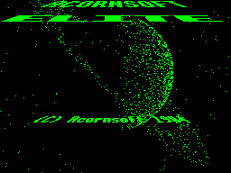

<table>

<tbody>

<tr class="odd">

<td>

<strong><em>Atomic Elite</em> loading screen</strong> 

<em>Posted: 10:16, 18 Aug 2013</em>
</td>

<td>
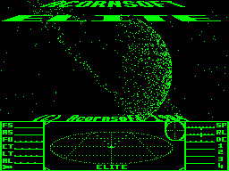

<strong><em>Atomic Elite</em> loading screen</strong> 

<em>Posted: 10:16, 18 Aug 2013</em>
</td>

<td>
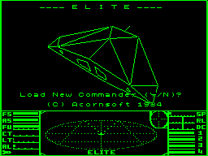

<strong><em>Atomic Elite</em> load new commander</strong> 

<em>Posted: 12:54, 18 Aug 2013</em>
</td>

</tr>

<tr class="even">

<td>
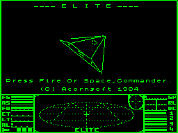

<strong><em>Atomic Elite</em> title screen</strong> 

<em>Posted: 12:54, 18 Aug 2013</em>
</td>

<td>
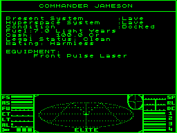

<strong><em>Atomic Elite</em> status</strong> 

<em>Posted: 12:54, 18 Aug 2013</em>
</td>

<td>
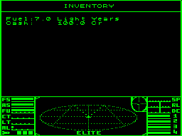

<strong><em>Atomic Elite</em> inventory</strong> 

<em>Posted: 12:54, 18 Aug 2013</em>
</td>

</tr>

<tr class="odd">

<td>
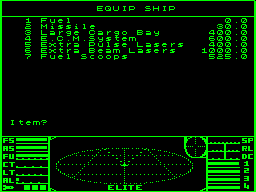

<strong><em>Atomic Elite</em> equip ship</strong> 

<em>Posted: 12:54, 18 Aug 2013</em>
</td>

<td>
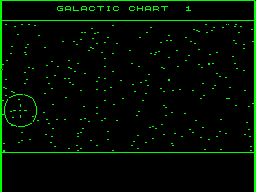

<strong><em>Atomic Elite</em> galactic chart</strong> 

<em>Posted: 12:54, 18 Aug 2013</em>
</td>

<td>
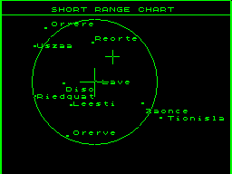

<strong><em>Atomic Elite</em> local chart</strong> 

<em>Posted: 12:54, 18 Aug 2013</em>
</td>

</tr>

<tr class="even">

<td>
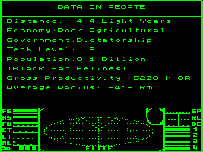

<strong><em>Atomic Elite</em> data on system</strong> 

<em>Posted: 12:54, 18 Aug 2013</em>
</td>

<td>
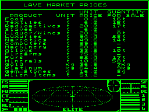

<strong><em>Atomic Elite</em> market prices</strong> 

<em>Posted: 12:55, 18 Aug 2013</em>
</td>

<td>
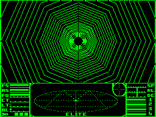

<strong><em>Atomic Elite</em> launch</strong> 

<em>Posted: 12:55, 18 Aug 2013</em>
</td>

</tr>

<tr class="odd">

<td>
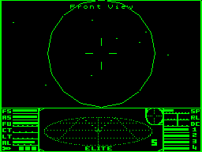

<strong><em>Atomic Elite</em> Lave</strong> 

<em>Posted: 12:55, 18 Aug 2013</em>
</td>

<td>
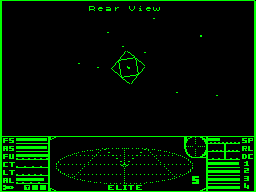

<strong><em>Atomic Elite</em> Lave space station 

(rear view)</strong> 

<em>Posted: 12:55, 18 Aug 2013</em>
</td>

<td>
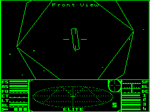

<strong><em>Atomic Elite</em> Lave space station close up</strong> 

<em>Posted: 12:55, 18 Aug 2013</em>
</td>

</tr>

<tr class="even">

<td>
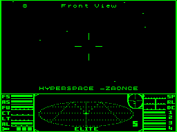

<strong><em>Atomic Elite</em> hyperspace - Zaonce</strong> 

<em>Posted: 12:55, 18 Aug 2013</em>
</td>

<td>
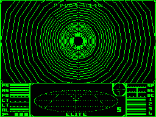

<strong><em>Atomic Elite</em> witchspace</strong> 

<em>Posted: 12:56, 18 Aug 2013</em>
</td>

<td>
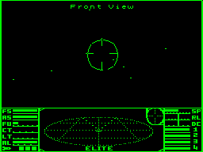

<strong><em>Atomic Elite</em> Zaonce</strong> 

<em>Posted: 12:56, 18 Aug 2013</em>
</td>

</tr>

<tr class="odd">

<td>
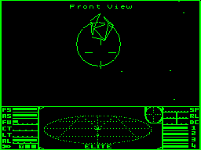

<strong><em>Atomic Elite</em> asteroid in Zaonce system</strong> 

<em>Posted: 12:56, 18 Aug 2013</em>
</td>

<td>
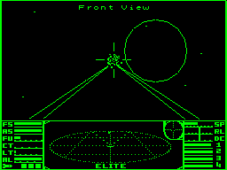

<strong><em>Atomic Elite</em> asteroid destruction 

in Zaonce system</strong> 

<em>Posted: 12:56, 18 Aug 2013</em>
</td>

<td>
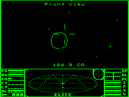

<strong><em>Atomic Elite</em> asteroid bounty 

in Zaonce system</strong> 

<em>Posted: 12:57, 18 Aug 2013</em>
</td>

</tr>

<tr class="even">

<td>
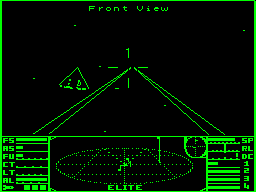

<strong><em>Atomic Elite</em> attacking a Mamba</strong> 

<em>Posted: 12:57, 18 Aug 2013</em>
</td>

<td>
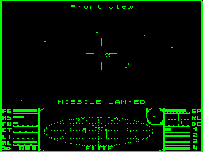

<strong><em>Atomic Elite</em> missile jammed!</strong> 

<em>Posted: 12:57, 18 Aug 2013</em>
</td>

<td>
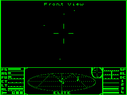

<strong><em>Atomic Elite</em> pirates closing in</strong> 

<em>Posted: 12:57, 18 Aug 2013</em>
</td>

</tr>

<tr class="odd">

<td>
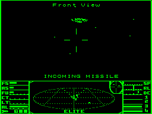

<strong><em>Atomic Elite</em> Cobra Mk III 

launches a missile</strong> 

<em>Posted: 12:57, 18 Aug 2013</em>
</td>

<td>

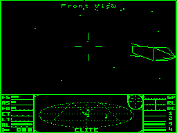

<strong><em>Atomic Elite</em> Cobra Mk III destroyed 

but missile impact imminent</strong> 

<em>Posted: 12:57, 18 Aug 2013</em>
</td>

<td>
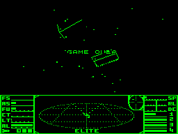

<strong><em>Atomic Elite</em> game over</strong> 

<em>Posted: 12:57, 18 Aug 2013</em>
</td>

</tr>

<tr class="even">

<td>

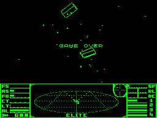

<strong><em>Atomic Elite</em> game over</strong> 

<em>Posted: 12:58, 18 Aug 2013</em>
</td>

</tr>

</tbody>

</table>

